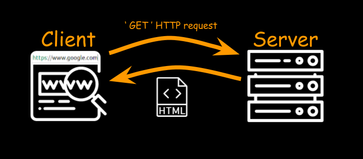
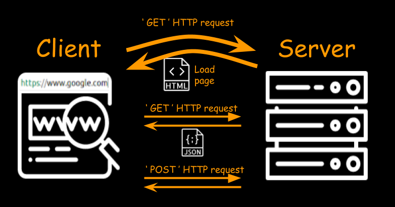
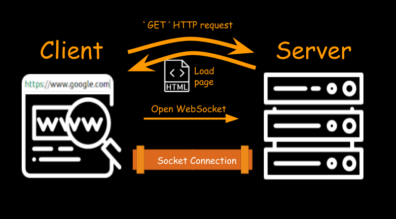

class: center, middle

.med-image[]
# JavaScript Review for Misty Robotics Hackathon
---
# About Misty
.left-column[
- Small personal robot made for developers
]
.right-column[

]
---
# About Misty
.left-column[
- Small personal robot made for developers
- Output:
  - Tread drive
  - RGB LED
  - LCD display
  - Speakers
]
.right-column[

]
---
# About Misty
.left-column[
- Small personal robot made for developers
- Output:
  - Tread drive
  - RGB LED
  - LCD display
  - Speakers
- Input: 
  - 4K Camera
     - Face detection
     - Object detection
  - Time-of-flight
  - Bump Sensors
]
.right-column[

]
---
# Goals
--

- Refresh yourself on JS Fundamentals
--

- Learn some basic features Mr. H didn't teach
--

- Get a quick peek at some advanced features
--

- Understand how Misty Robotics uses JS
--

- Gain a better understanding of how JS is used
---
# Why/What is JavaScript?
--

_JavaScript_ is one of the most popular programming languages, mainly used for web development
--

- Interpreted
--

- Dynamically typed
--

- Popularized for front-end web development
--

  - Now _Node.js_ is a popular back-end JS runtime
--

- Not directly related to _Java_
--

- Standardized by the _ECMAScript_ specification (ES6)
--

- Fun! (maybe)
--


**But most importantly**, JS is what we need in order to program the Misty I
---
# Here's some code

.bigger-code[```
// This is a short test of the syntax highlighter :)
function hello(name) {
	let a = new Array(1, 2, 3);
	let b = [true, false, 'truey'];
	let i = 0;
	for (let j = 0; j < i; j++) {
		console.log({
			a: i + 12,
			b: j + 11
		});
	}
	console.log('hello ' + name);
	return new Array(10);
}

hello('Weston');
```]
---
# Types
--

### Primitives:
- string
- number
- boolean

--

### Special values:
- `undefined`
- `null`

--

Also, objects and symbols :)
---
# Strings
--

### Literals:
.bigger-code[
```
"I'm double quoted"
'I am "single" and ready to pringle'
`I support a bunch of "cool" things including new
lines, which the others don't do`
```
]

--

### Operations:
.bigger-code[
```
'con' + 'cat' + 'enate'
```
]
---
# Numbers
--

### Literals:
```
13
3.14
Infinity
NaN
```
--

### Operations:
```
10 + 3     // 13
1.57 * 2   // 3.14
-1 / 0     // -Infinity
10 - 'hi'  // NaN
11 % 3     // 1
2 ** 7     // 128
-5         // -5
+10        // 10
```
---
# Math Interlude! Yay!
--

The JS Math functions are very similar to `java.lang.Math`
--

.bigger-code[
```
Math.random() // number between 0 and 1
Math.floor(13.8) // 13
Math.ceil(12.2)  // 13
Math.max(13, 2)  // 13
Math.min(13, 22) // 13
Math.pow(13, 2)  // 169 (use ** instead)
```
]
---
# Booleans
--

### Literals:
.bigger-code[
```
true
false
```
]
--


### Operations:
.bigger-code[
```
true && false
true || false
!true
```
]
---
# Special "types" / values
--

- `undefined` is a special empty value assigned by JS when it doesn't have a value for something
--


- `null` is a special empty value which can be assigned to a variable to flag it as "empty" or "clear" its value
--


.bigger-code[
```
let negativeRoot
console.log(negativeRoot) // undefined

// ... more code ... //

negativeRoot = null
console.log(negativeRoot) // null
```
]
---
# Type conversions
--

Conversions happen implicitly all the time. Use the `Number`, `String`, and `Boolean` functions to force a conversion
--

```
// To Boolean
0, NaN, '', null, undefined -> false
-5, 'hi', 0.1 -> true
```
--

```
// To Number
' -30.50 \n ' -> -30.5
'soo many big' -> NaN
true -> 1
false -> 0
```
--

```
// To String
50 -> '50'
undefined -> 'undefined'
true -> 'true'
```
---
# Some tricky tricksters
--

.bigger-code[
.left-column[
```
10 - true         // 9
10 + '6'          // '106'
1 < 2 < 3         // true
3 > 2 > 1         // false
5 / '2'           // 2.5
5 - '2'           // 3
!!0               // false
null || ''        // ''
NaN || 0          // 0
' ' && !undefined // true
```
]
.right-column[
```
-'\n'             // -0
+undefined        // NaN
'1' + 2 + 3       // '123'
1 + 2 + '3'       // '33'
true + true       // 2
// Strict Equality :)
1 == '1.0'        // true
1 === '1.0'       // false
+null == false    // true
+null === false   // false
```
]]
---
# Variables: `var` vs `let`
--

`var` and `let` are both keywords for declaring a variable. `let` is more modern and should be preferred
--

- `var` uses _functional_ scope
--

- `let` uses _block_ scope
--

- Quite a few other cool, but subtle differences
--


```
function dontWorryAboutMeImaFunction() {
	var a = 'apples'
	let b = 'banannas'
	if (true) {
		var c = 'cantaloupe'
		let d = 'didgeridoo'
	}

	a += ' are fruit' // OK
	b += ' are food'  // OK
	c += ' are good'  // OK
	d += ' are mood'  // ERROR: d is not defined
}
```
---
# Simple output
--

- `alert` does blocking output in a pop-up
--

- `console.log` logs to the developer console
--


.bigger-code[
```
let name = 'Weston'

console.log(name + ' prefers me because:')
console.log('- I\'m quiet')
alert('Interrupting cat says "mew"')
console.log('- I don\'t interrupt')
```
]
---
# Conditionals
--

- `if () { } else if () { } else { }`
--

- `condition ? expression1 : expression2`
--


```
let voltage = 11
// Ternaries often go in parenthesis to improve clarity
let message = (voltage < 12 ?
	'charge the battery' :
	'check both phone batteries')
console.log('magic 8 ball says to ' + message)

// Same code, but with if-else instead //
let voltage = 11
let message
if (voltage < 12) {
	message = 'charge the battery'
} else {
	message = 'check both phone batteries'
}
console.log('magic 8 ball says to ' + message)
```

---
# Loops
--

- `while (condition) { }`
--

- `for (init; condition; update) { }`
--

- Don't forget `break` and `continue`
--


.bigger-code[
```
let i = 1
while (i <= 50) {
    console.log((i % 3 == 0 ? 'Fizz' : '') +
                (i % 5 == 0 ? 'Buzz' : '') || i)
    i++
}

// Equivalent grossness, but with a for loop //
for (let i = 1; i <= 50; i++) {
    console.log((i % 3 == 0 ? 'Fizz' : '') + 
                (i % 5 == 0 ? 'Buzz' : '') || i)
}
```
]
---
# Function Declarations
--

JS functions do normal functiony things like arguments, returns, and recursion
--

.bigger-code[
```
// You can call fib before it has been declared
console.log(fib(7)) // 13

// Returns the nth fibonacci number
function fib(n) {
	if (n <= 0)
		return // Same as `return undefined`
	if (n <= 2) 
		return 1
	return fib(n - 1) + fib(n - 2)
}
// The above example is bad :(
```
]
---
# Function Expressions
--

A function expression leaves out the name of the function: `function(args) {...}`
--

.bigger-code[
```
function add(a, b) {
	return a + b
}
add(10, 3) // 13

// A function is a value like any other! 
let sub = function(a, b) {
	return a - b
}
sub(10, 3) // 7

// add is also a variable. We can do things with it!
let concat = add
concat('10', '3') // '103'

```
]
---
# A Convoluted Example
--

.bigger-code[
```
function sayHello(name, showMessage) {
	let message = 'Hello, ' + name + '!'
	// Default behavior is to use console.log
	if (showMessage === undefined) {
		console.log(message + ' (default)')
		return
	}
	showMessage(message)
}

sayHello('Ainsley')
sayHello('Makenna', alert)
sayHello('Mathew', console.error) // like console.log
sayHello('Weston', sayHello)
```
]
---
# The Callback Pattern
--

A callback is a function argument to be called later (often when the function is finished)
--

```
function flipCoin(p, heads, tails) {
	if (Math.random() > p) {
		heads()
	} else {
		tails()
	}
}

flipCoin(0.6,
	function() {
		console.log('Heads, Weston wins!')
	},
	function() {
		console.log('Tails, you win :(')
	})
```
---
# Objects
--

JS Objects are sets of properties (key-value pairs) where the keys are strings\*
--

#### Literals
.bigger-code[
```
let programmer = {
	name: 'Weston',
	age: 18,
	'key': 'value'
}
```
]
--


#### Operations
.bigger-code[
```
console.log(programmer.name + ' Wrote this')
console.log('When they were ' + programmer['age'])
programmer.key = 'new value'
```
]
---
# JSON
--

- _JavaScript Object Notation_
--

- Popular way to structure and send data
--

- Like _XML_ and _YAML_, but with syntax like JS
--


.bigger-code[
```
{
	id: 10,
	type: 'subscribe',
	dimensions: {
		width: 400,
		height: 300,
	},
	block: true,
	pages: [13, 26, 169], // Array :P
}
```
]
---
# JSON parse and stringify
--

JavaScript has a way to convert between strings of JSON and JS Objects: `JSON.parse` and `JSON.stringify`

--
.bigger-code[
```
let me = {
	name: 'Weston',
	age: 18,
	favorites: {
		animal: 'marmot',
		number: 13,
	},
}

let myString = JSON.stringify(me)
console.log(myString) // {"name":"Weston","age":18...

let pos = JSON.parse('{x: 13, y: 169}')
console.log(pos.x + ', ' + pos.y) // 13, 169
```
]
---
# `this` keyword
--

- The value of a property can be a function! A function which is the property of an object is called a _method_
--

- Similar to Java, `this` refers to the object the method is a property of (most of the time)
--


.bigger-code[
```
let cat = {
	name: 'Wobbly',
	sound: 'Meowwww',
	makeSound: function() {
		console.log(this)
		console.log('I say ' + this.sound)
	}
}

cat.makeSound()
```
]
---
# Constructor functions 
--

- A good way to define lots of similar objects is with a constructor function
--

- Not meant to be called as a function at all
--

- Invoke with `new` keyword
--

- Builds an object with `this` keyword
--


.bigger-code[
```
let Cat = function(name, color) {
	this.name = name
	this.color = color
	this.speak = function() {
		console.log(this.name + ' is ' + this.color)
	}
}
let leo = new Cat('Leonardo', 'orange')
leo.name = 'Leo'
leo.speak()
```
]
---
# Type system recap
--

We've seen all\* the types now!
--

- Primitives: number, string, boolean
--

- Special values: `null`, `undefined`
--

- And objects
--


The other "types" like arrays and functions are really just objects!
---
# Arrays
--

#### Literals
.bigger-code[
```
[1, 3, 6, 10, 15, 21, 28]
[true, 'mixed', 13, undefined]
[
	{x: 13, y: 169}, 
	function() {
		console.log('I am a function in an array')
	},
	[['n', 'e', 's'], ['t', 'e', 'd']],
]
```
]
--


#### Operations
.bigger-code[
```
let friends = ['Makenna', 'Ainsley', 'Mathew']
console.log(friends[1] + ' likes PHP? :(')
friends[friends.length - 1] += ' Chen'
```
]

---
# Some useful functions
--

.bigger-code[
```
// Splits a string into an array
let ip = '68.169.122.13'
let ipArray = ip.split('.')
console.log(ipArray) // ['68', '169', '122', '13']

// slice gets part of a string or array (inclusive)
let name = 'Waston Mex Matzlar'
let middle = name.slice(7, 10)
console.log(middle)

// setTimeout takes a callback function to call later
setTimeout(function() {
	console.log('1000ms have passed')
}, 1000)
```
]
---
# HTML Refresher
--

.bigger-code[
```html
<!doctype html>
<html>
  <head>
    <title> I'm in the tab! </title>
    <!-- External JS -->
    <script src="something.js"></script>
  </head>
  <body>
    <h1> Hello World </h1>
    <p class="boring-info"> 
		lorem upspin or something......... 
	</p>
    <button type="button" id="go-btn">Go!</button>
  </body>
</html>
```
]
---
# The DOM
--

The __Document Object Model__ (DOM) is used to interact with the contents of the page.
--

- Rooted at `document`
--

- Consists of DOM elements and their connections
--

- `document.getElementByID(..)` to select elements
--

- DOM elements have an `innerHTML` property, which you can access and modify
--

- And much more
--


.bigger-code[
```
// Change the title
let title = document.getElementById('the-dom')
title.innerHTML = 'The Dope Object Model'
```
]
---
# Events
--

- JS is an _Event Driven_ language
--

- Events handlers are functions tied to objects that "fire" when the event occurs
--

- `onclick`, `onchange`, `onmessage`, `onclose`, `onsubmit`
--


#### Touch Me!
.bigger-code[
```
let button = document.getElementById('touch-me-')
button.onclick = function(event) {
	alert('click!')
	button.innerHTML = 'I\'ve been tickled'
}
button.onmouseover = function() {
	button.innerHTML = 'TOUCH ME!'
}
```
]
---
# Webpage requests
--


---
# Dynamic http requests
--


---
# AJAX
--

- __Asynchronous JavaScript And XML__
--

- Make requests to the server without reloading the page
--


.bigger-code[
```
function fetchAndLogMarmot() {
	let xhttp = new XMLHttpRequest();
	xhttp.onreadystatechange = function() {
		if (xhttp.readyState == 4) {
			let jsonString = xhttp.responseText
			let buddy = JSON.parse(jsonString)
			console.log(buddy)
			console.log(buddy.fur.descriptors)
		}
	}
	xhttp.open('GET', 'marmot.json', true)
	xhttp.send()
}
```
]
---
# WebSockets!
--


---
# Using a Websocket
--

- Open a WebSocket with `new WebSocket(..)`
--

- Use `ws://` for the _protocol_
--

- Use the `onmessage` and `onclose` events
--


.bigger-code[
```
let ws = new WebSocket(
	'ws://67.177.227.86:6213/piglatin')

ws.onmessage = function(event) {
	console.log('ws recieved ' + event.data)
}

ws.send('turn me into pig latin')
```
]
---
# JavaScript on the server?!
--

- Yeah, you can do that! A popular way is with Node.js
--

- Node is a JS runtime using the Chrome V8 engine
--

- Still JS, but with a different runtime environment
--

- This might be how we write code on the Misty?
---
# Recap - We've covered a lot!
--

- Types: number, string, boolean, object
--

- `let` vs `var`
--

- Output via console, alert, or the DOM
--

- Control structures: `if`, `for`, `while`
--

- function declarations, expressions, and callbacks
--

- Objects, JSON, and `this`
--

- Useful built-in functions and arrays
--

- HTML and the DOM
--

- Event handlers such as `onclick`
--

- AJAX and WebSockets
---
# Applying this to Misty!
--

- Control the Misty I through the REST API
--

  - Make a web app with user input / output
--

  - Access the API with AJAX and WebSockets
--

- Control the Misty I by giving it _Skills_
--

  - Skills are JS apps that run directly on the Misty I
--

  - A web app accessing the REST API calls Misty Skills
---
# LightClient
--

_lightClient.js_ is a helpful JS library for interacting with the REST API
--

- Let's take a look: [lightClient.js](https://github.com/MistyCommunity/Hackathon/blob/master/Assets/javascript/lightClient.js)
---
# Drive Example
--

.left-column[
`drive.html`
```html
<!doctype html>
<html>
  <head>
    <title> Drive! </title>
    <script src=
	  "../Tools/lightClient.js">
	</script>
  </head>
  <body>
    <button type="button"
	        id="go">
	  Go!
	</button>
    <button type="button"
	        id="stop">
	  Stop
	</button>
	<script src="app.js"></script>
  </body>
</html>
```
]
--

.right-column[
`app.js`
```
let client = 
  new LightClient('155.213.111.13')

let driveData = {
  LinearVelocity: 30, // 30% speed
  AngularVelocity: 0, // Don't spin
}

let goBtn = document.
  getElementById('go')
let stopBtn = document.
  getElementById('stop')

goBtn.onclick = function() {
  client.PostCommand('drive', 
                     driveData)
}
stopBtn.onclick = function() {
  client.PostCommand('stop') 
}
```
]
---
# A Misty WebSocket example
---
# Pruned API reference
---
# Project Time!
--

When the user hits a button, your webpage gets a random quote (using AJAX), converts it to piglatin, and then displays it. Example: http://vvest.in/pigquote.html
--

- Access [this](https://opinionated-quotes-api.gigalixirapp.com/v1/quotes) REST API for random opinionated quotes:
  - `https://opinionated-quotes-api.gigalixirapp.com/v1/quotes`
--


1. Create a webpage to display your quote on
  - You need to access elements on the page through the DOM to change the contents
--

2. Retrieve a random quote. See AJAX slide
--

3. Convert to pig-latin. `split`, `slice`, `includes`
--

4. Update the DOM. `getElementByID`, `innerHTML`
---
# Q&A / Additional topics
--

- There are no stupid questions! Please fire away?
--


### Additional topics

--

- Promises, `async`, and `await`
--

- jQuery
--

- Error handling
--

- Date and time
--

- Array methods
--

- Classes :(
--

- Canvas
--

- Keyboard input
--

- Regexp
--

- DOM in more detail
---
# jQuery
--

- I (Weston) have never used jQuery in a project. This is where I lose all credibility as a presenter
--

- Front-end JS library for better DOM manipulation (among many other things)
--

- So popular that you almost can't say you know JS without knowing jQuery
--

- You might see jQuery being used in Misty code
--

- jQuery provides just 1 function: `$` 
--


.bigger-code[
```
// This is some example code from jquery.com
var hiddenBox = $('#banner-message');
$('#button-container button').on('click', 
	function(event) {
		hiddenBox.show();
	});
```
]
---
# `async` and `await`
--

- You _might_ see these keywords. Stay calm!
--

- These have to do with promises, which are a special JS object for making chains of asyncronous function calls more graceful
--


.bigger-code[
```
async function doSomething() {
	await new Promise(function(resolve, reject) {
		setTimeout(function() {
			resolve('finished :)')
		}, 3000)
	}).then(function(result) {
		console.log(result)
	})
	console.log('The wait is over')
}
```
]
---
# Further Reading
- [light JS review](https://javascript.info/javascript-specials)
- [beginner JS practice](https://www.codecademy.com/learn/introduction-to-javascript)
- [Khan Academy JS (with graphics)](https://www.khanacademy.org/computing/computer-programming)
- [comprehensive JS review](https://javascript.info/js)
- [writing Misty skills](https://github.com/MistyCommunity/Hackathon/blob/master/Skill%20Sample/Skills.md)
- [Misty REST API Reference](https://documenter.getpostman.com/view/3743818/RWEgpdTW#ea0ff3b1-b3a2-b50b-5347-75dc19b62681)
- [Misty Examples](https://github.com/MistyCommunity/MistyI/tree/master/Skills) (These "skills" don't run on the robot)
